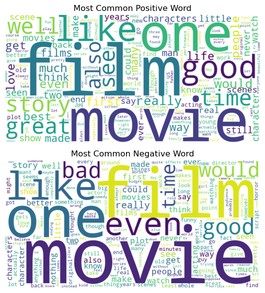

# IMDb Movie Sentiment Analysis - EDA


## Overview

Exploratory data analysis on **50,000 IMDb movie reviews** to understand how positive and negative reviews differ in vocabulary, review length, and common phrases.

This project demonstrates practical skills in **Python, Pandas, NLP preprocessing, data visualization, n-gram analysis, and statistical testing**.

## Dataset

- **Rows:** 50,000 movie reviews
- **Columns:** `review`, `sentiment`
- **Target classes:** 25,000 positive and 25,000 negative reviews
- **Source file:** `data/IMDB Dataset.csv`

## Visual Insight



The word cloud shows that positive reviews often contain appreciation-focused words such as `great`, `love`, `best`, and `story`, while negative reviews highlight stronger criticism-oriented words such as `bad`, `worst`, and `waste`.

## Key Findings

- The dataset is perfectly balanced with **25,000 positive** and **25,000 negative** reviews.
- Average review length is around **231 words**.
- IQR-based outlier detection found **3,708 unusually long or short reviews**.
- Positive reviews slightly differ in average length, but review length alone is not a strong sentiment indicator.
- Negative reviews contain highly expressive phrases such as `worst movie ever`, `waste time`, and `bad movie`.
- Sentiment is better explained by vocabulary and phrase patterns than by review length alone.

## Techniques Used

- Data cleaning and inspection
- Review length feature engineering
- Outlier detection using IQR
- Stopword removal with NLTK
- Word frequency analysis
- Bigram and trigram extraction
- Word cloud visualization
- T-test and chi-square hypothesis testing

## Tech Stack

`Python` `Pandas` `NumPy` `Matplotlib` `Seaborn` `NLTK` `Scikit-learn` `SciPy` `WordCloud` `Jupyter Notebook`

## Project Structure

```text
.
|-- assets/
|   `-- wordcloud_positive_negative.png
|-- data/
|   `-- IMDB Dataset.csv
|-- movieSentimentAnalysis.ipynb
`-- README.md
```

## How to Run


```bash
git clone https://github.com/Sushil-Kumar-Sahoo/IMDB_Movie_Sentiment_Analysis.git
cd IMDB_Movie_Sentiment_Analysis
pip install pandas numpy matplotlib seaborn nltk scikit-learn scipy wordcloud jupyter
jupyter notebook movieSentimentAnalysis.ipynb
```

## Future Improvements

- Build a sentiment classification model using TF-IDF and Logistic Regression.
- Evaluate model performance with accuracy, precision, recall, F1-score, and confusion matrix.
- Create a simple Streamlit app for real-time review sentiment prediction.

---

**Author:** Sushil Kumar Sahoo
